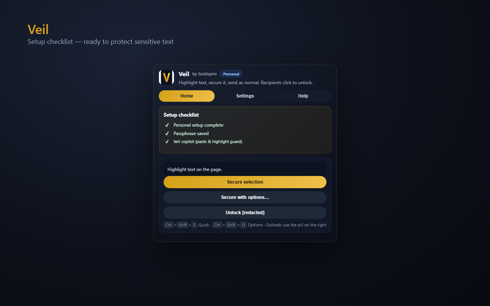
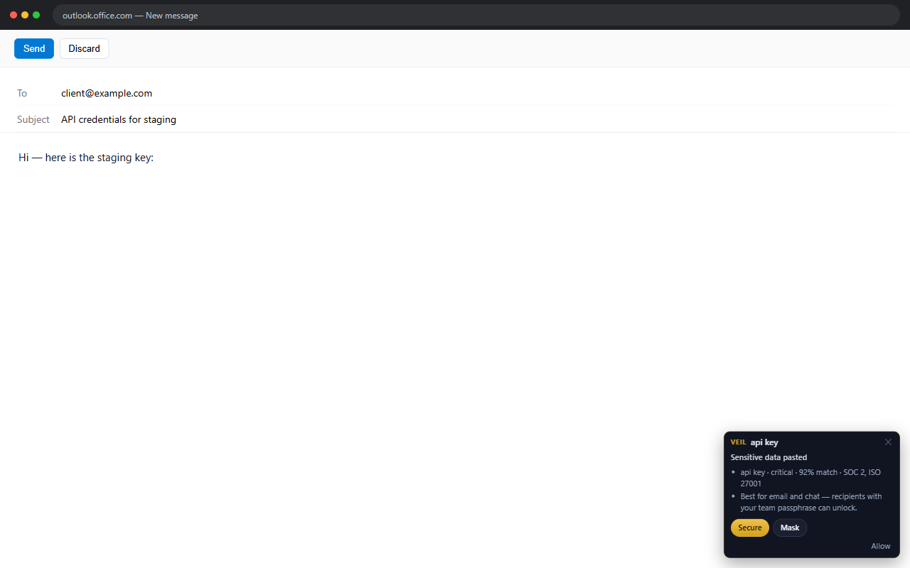

# Veil personal user guide

Quick start for **Personal** profile users (no team, no join code).

> Screenshots: [docs/screenshots/](screenshots/README.md)

## Install

1. Install from [Microsoft Edge Add-ons](https://microsoftedge.microsoft.com/addons/search/Veil%20Goldspire) or [Chrome Web Store](https://chromewebstore.google.com/search/Veil%20Goldspire) (search **Veil by Goldspire**).
2. Open the Veil popup → **Personal** → choose a passphrase (**16+ characters**).

## Daily use

| Action | What happens |
|--------|----------------|
| **Paste** a secret in email or a form | Copilot offers **Secure** or **Mask** |
| **Highlight** text | Veil bar appears with Quick / Options |
| **Ctrl+Shift+S** (⌘+Shift+S on Mac) | Secure selection with saved passphrase |
| **Ctrl+Shift+O** | Secure with options (one-time code, etc.) |

Smart copilot stays quiet while you type name, email, or DOB on signup forms — but still catches API keys.

## Recipients without Veil

Share the passphrase out of band. If you use one-time mode, share the unlock code separately. External recipients can use the [hosted unlock page](https://join-veil.goldspireventures.com/unlock.html) when you include a link.

## Settings

- **Veil copilot** — on by default; turn off in Settings if you prefer shortcut-only
- **On-page hints** — Smart / Always / Off
- **Share anonymous copilot signals** — on by default under Help; improves Veil for everyone (metadata only, never your text). Uncheck to opt out.
- **Feedback** — Help tab → Report a problem

## Help tab matches your settings

Open the extension popup → **Help** → **Your setup**. Veil explains how your current settings behave — for example why the Quick/Options pill does not appear when you highlight plain text in **Smart** mode, or why copilot stays quiet on signup forms. The **Why isn't something showing?** section only lists issues that apply to your configuration (copilot off, hints off, snoozed sites, missing passphrase, etc.).

From **Home**, use **How Veil behaves with your settings →** for the same guide.

## Upgrade to a team

Ask your admin for a join code, or [create a team](https://join-veil.goldspireventures.com/create.html) for your organization.
